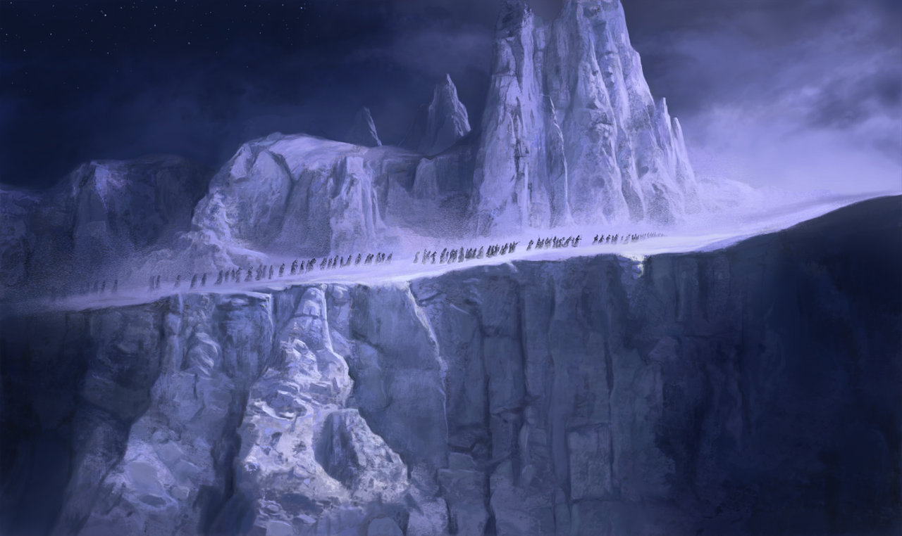

# Helcaraxë


> The Helcaraxë or "Grinding Ice" was an icy waste between the lands of Aman and Middle-earth. Its exact nature is left unclear, but it seems to have been an area of broken and shifting pack ice covering the northernmost parts of the Great Sea.
-- https://lotr.fandom.com/wiki/Helcarax%C3%AB

Helcaraxë era um território inóspito que ligava Aman à Terra-Média. Paralelamente, pretendo configurar aqui um ponto central de configuação e interconexão dos diversos serviços que pretendo desenvolver.

Quais serviços? Coisas do trabalho. Sabe quando você acha que poderia desenvolver os sistemas de modo melhor do que eles foram desenvolvidos pelas equipes da firma? Quando o tédio bate a gente se acha capaz de tudo, vamos ver o que vai sair daqui. 🫣

## Pré-requisitos
- [Git](https://git-scm.com/)
- [Docker](https://www.docker.com/)
- [Docker Compose](https://docs.docker.com/compose/install/)

## TL/DR
```
$ git clone git@github.com:cleiver/helcaraxe.git
$ cd helcaraxe
$ git submodule init 
$ git submodule update
$ docker-compose up
```